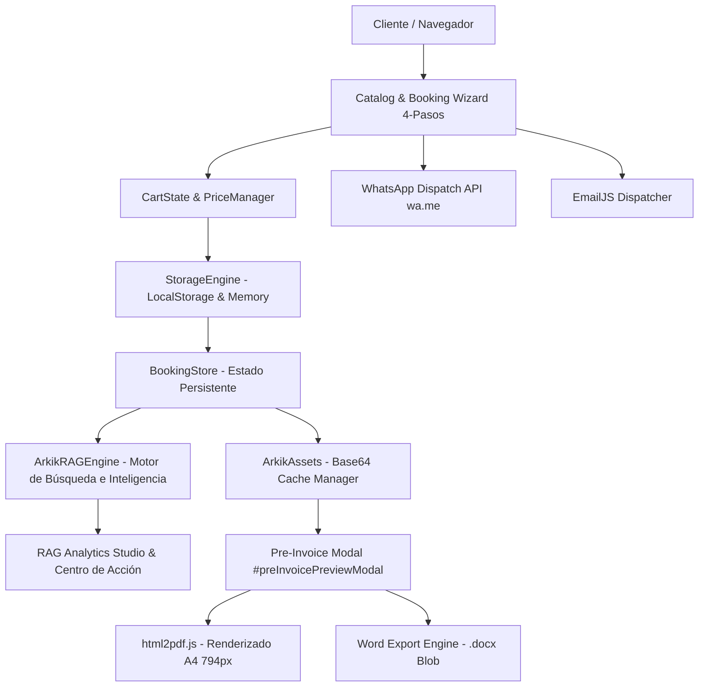

# 🎸 Arkik Productions — Executive Operating System & Booking Engine

Plataforma ejecutiva de alto rendimiento (SPA) y sistema operativo de gestión de eventos, cotizaciones dinámicas, validación bancaria **SINPE Móvil**, motor de búsqueda y agregación determinista (**ArkikRAGEngine**) y subsistema de generación de documentos contractuales en **PDF y DOCX** para **Arkik Productions** (Granadilla, Curridabat, San José, Costa Rica).

---

## 1. System Architecture Overview

Arkik OS está diseñado como una aplicación web de una sola página (**Single Page Application**) construida sobre una arquitectura modular pura en Vanilla JavaScript (ES2022+), CSS3 con variables de diseño líquido y Tailwind CSS.



### Principales Módulos del Sistema:
- **`js/data.js`**: Definición estricta de fuentes de datos, catálogo de servicios musicales (Banda RT, Trío, Dúo, Solista, Alquiler de Sonido), mapa geográfico de Costa Rica (7 provincias, 84 cantones, clasificación GAM vs. Fuera de GAM), configuración de SINPE Móvil y credenciales criptográficas de acceso administrativo.
- **`js/app.js`**: Núcleo reactivo que alberga:
  1. `ArkikAssets`: Pre-cargador asíncrono y gestor de caché de assets en Base64 con fallback SVG determinista.
  2. `CartState` & `PriceManager`: Máquina de estado para cotizaciones en tiempo real con recálculo instantáneo de horas extra (50% base), DJ en recesos, refuerzo acústico de subwoofers 18" y recargo de viáticos del 12% fuera de GAM.
  3. `BookingStore`: Almacén transaccional de reservas locales con estados `pendiente`, `confirmado` y `cancelado`.
  4. `ArkikRAGEngine` & `RAGStudio`: Motor de indexación determinista, métricas financieras en tiempo real y centro de acción táctil.
  5. `ModalController`: Máquina de estados determinista para modales (`#booking-modal`, `#adminPortalModal`, `#preInvoicePreviewModal`, etc.) que garantiza contención del viewport y cero scroll fantasma.
  6. Sub-sistema de Exportación Documental: Generador A4 de prefacturas y comprobantes en PDF (vía `html2pdf.js`) y Word (`.docx`).

---

## 2. Data Flow & RAG Search Engine

El módulo **`ArkikRAGEngine`** implementa un motor de inteligencia operativa determinista sobre las reservas activas en `BookingStore`, sin dependencias externas de IA generativa ni consumo de APIs de embeddings, garantizando latencia cero y precisión matemática total:

### 2.1 Indexación y Normalización de Registros:
- **Indexación automática**: Cada reserva en `BookingStore` se indexa con tags operacionales deterministas (`[Pendientes SINPE]`, `[Confirmadas]`, `[Fuera GAM]`, `[Banda RT]`, `[72h Urgentes]`).
- **Validación SINPE**: Distingue reservas con adelanto liquidado (`depositSettled: true` / estado `confirmado`) frente a solicitudes con validación pendiente.
- **Regla Operacional de 72h**:
  - Detección proactiva de eventos programados dentro de las próximas 72 horas con saldo o depósito sin liquidar.
  - Alerta en el dashboard ejecutivo con nivel de criticidad prioritario para evitar colisiones de agenda o movilización de equipo sin garantía.

### 2.2 Agregados y Métricas Financieras en Vivo:
- **Total Recaudado**: Sumatoria exacta de depósitos del 50% vía SINPE Móvil verificados.
- **Saldos Pendientes en Escena**: Montos contratados por liquidar el día del show antes del montaje.
- **Tasa de Conversión**: Porcentaje de cotizaciones emitidas que culminan en reservas formales confirmadas.
- **Proyecciones Semanales**: Agrupación cronológica por semanas ISO de ingresos futuros ya comprometidos.

---

## 3. PDF & DOCX Export Subsystem

El subsistema de renderizado documental formaliza las cotizaciones y reservas en comprobantes ejecutivos con fidelidad de impresión A4:

```text
+-----------------------------------------------------------------------+
|  PRE-INVOICE MODAL ENGINE (#preInvoicePreviewModal)                   |
|                                                                       |
|  [📥 Descargar PDF Oficial]  [📄 Descargar Word (.docx)]  [✕ Cerrar]  |
|                                                                       |
|  +-----------------------------------------------------------------+  |
|  |  Bounded A4 Sheet (max-width: 794px, padding: 28px, box-sizing) |  |
|  |                                                                 |  |
|  |  [Logo Base64]   ARKIK PRODUCTIONS       N° ARK-XXXXXXXX        |  |
|  |                  Música en Vivo & Sonido Fecha: 29/09/2026      |  |
|  |                                                                 |  |
|  |  PREFACTURA Y COMPROBANTE DE RESERVA     [Estado Badge]         |  |
|  |                                                                 |  |
|  |  Cliente / Contacto            Detalles del Evento              |  |
|  |  Juan Pérez (+506 8888-8888)   Banda RT · 15 Nov · Heredia      |  |
|  |                                                                 |  |
|  |  Ledger de Logística (Montaje: 2h antes · Show · Desmontaje)    |  |
|  |                                                                 |  |
|  |  Desglose Financiero: Total ₡ · Adelanto 50% ₡ · Saldo ₡        |  |
|  |  Instrucciones SINPE Móvil: 6227-4984 (Juan José Ramírez)       |  |
|  +-----------------------------------------------------------------+  |
+-----------------------------------------------------------------------+
```

### 3.1 Manejo de Assets en Base64 (`ArkikAssets`):
- `ArkikAssets.init()` se ejecuta inmediatamente al cargar el script, solicitando de forma asíncrona `img/arkik_logo.jpg` y convirtiéndola en Data URL Base64 (`ArkikAssets.logoBase64`).
- **Fallback SVG garantizado**: Si la red o el entorno local offline fallan, `_generateFallbackLogo()` genera un isotipo SVG corporativo codificado en Base64, evitando que los motores `html2canvas` o `html2pdf.js` queden esperando imágenes no resueltas o generen hojas en blanco.

### 3.2 Bounding A4 & Configuración de `html2pdf.js`:
- El canvas de renderizado está acotado estrictamente a **`794px`** de ancho (equivalente matemático a los $210mm$ de una hoja A4 a $96dpi$) con **`28px`** de padding interno y `box-sizing: border-box`.
- La llamada a `html2pdf.js` se ejecuta con parámetros calibrados:
  ```javascript
  html2pdf().set({
    margin: 0,
    filename: 'Prefactura_' + booking.id + '.pdf',
    image: { type: 'jpeg', quality: 0.98 },
    html2canvas: { scale: 2, useCORS: true, windowWidth: 794 },
    jsPDF: { unit: 'pt', format: 'a4', orientation: 'portrait' }
  }).from(contentElement).save();
  ```

### 3.3 Exportador Word (.docx):
- Genera un documento nativo enriquecido en formato Word Processing ML empaquetado en Blob MIME `application/vnd.openxmlformats-officedocument.wordprocessingml.document`, descargable como `Prefactura_[ID].docx` e interpretable en Microsoft Word, Google Docs y LibreOffice Writer.

---

## 4. UI Design System

Inspirado en la estética **Liquid Glass / Obsidian Glass** con micro-interacciones táctiles:

### 4.1 Tipografía Oficial:
- **Fuente Primaria (UI & Títulos)**: `Plus Jakarta Sans`, sans-serif (pesos 400, 500, 600, 700, 800) importada vía Google Fonts.
- **Fuente Numérica y Código**: `JetBrains Mono`, monospace (pesos 400, 600, 700) aplicada a columnas monetarias (₡), hashes de reserva (`ARK-XXXXXXXX`), contadores y badges numéricos para alineación tabular perfecta (`tabular-nums`).

### 4.2 Paleta de Colores & Acentos:
- **Base / Dark Canvas**: `#07040e` / `#0b0914` con orbes de luz ambiental púrpura, índigo y fucsia.
- **Púrpura Ejecutivo (Primary)**: `#8b5cf6` / `#6d28d9` / `#4c1d95`.
- **Esmeralda Éxito (SINPE Verificado)**: `#10b981` / `#047857` / `rgba(16, 185, 129, 0.3)`.
- **Ámbar Alerta (SINPE Pendiente)**: `#f59e0b` / `#b45309`.
- **Cian Inteligencia (Métricas & Proyecciones)**: `#06b6d4` / `#0891b2`.

### 4.3 Componentes y Micro-Interacciones:
- **Centro de Acción ("Centro de Acción" en `#ragStudioView`)**:
  - `rag-action--export`: Glow púrpura `hover:shadow-[0_0_20px_rgba(168,85,247,0.3)] bg-purple-900/30 border-purple-500/30 text-purple-200`.
  - `rag-action--whatsapp`: Glow esmeralda `hover:shadow-[0_0_20px_rgba(16,185,129,0.3)] bg-emerald-900/30 border-emerald-500/30 text-emerald-200`.
  - `rag-action--projection`: Glow cian `hover:shadow-[0_0_20px_rgba(6,182,212,0.3)] bg-cyan-900/30 border-cyan-500/30 text-cyan-200`.
  - Respuesta háptica: `active:scale-95 transition-all duration-150`.
- **Glass Trigger Pills en Tarjetas de Reserva**:
  - Botones píldora translúcidos (`rag-pill-btn`) para **Previsualizar**, **Generar PDF**, **WhatsApp** y **Editar**.

---

## 5. Installation, Local Running & Automated Testing

### Requisitos Previos:
- **Node.js** v18.0.0 o superior.
- Navegador web moderno compatible con ES Modules y Canvas 2D (Chrome, Firefox, Safari, Edge).

### Instalación de Dependencias:
```bash
npm install
```

### Ejecución Local:
Para iniciar el servidor de desarrollo estático:
```bash
npm run dev
```
O bien abrir directamente `index.html` en el navegador web o mediante extensiones como Live Server.

### Suite de Pruebas Automatizadas:
Para validar la integridad de sintaxis, alcances y tipos en todos los módulos JavaScript del sistema:
```bash
npm test
```
Este comando ejecuta de manera estricta:
```bash
node --check js/app.js && node --check js/data.js
```
Garantizando **0 errores de sintaxis** y consistencia en el árbol de ejecución del motor.

---

© 2026 **Arkik Productions** — Música en Vivo & Sonido Profesional · Granadilla, San José, Costa Rica.